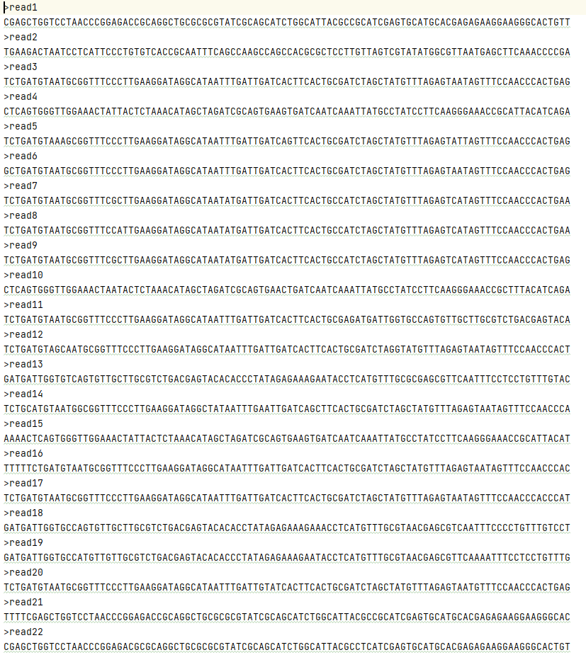
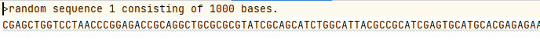
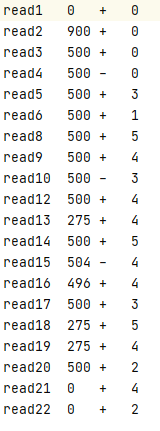

# BIF Project Minimapper

Realisation of a mapper for Bioinformatics.  
The goal was to map small sequences on a reference genome (much larger).

More information in 2 *pdf in **rapports/** folder.  
Project for University.

## Preview

**Reads input file**  


**Reference input file**  


**Results output file**  

## How to start

Define program arguments  

| Program argument | Value                               |
| ---------------- | ----------------------------------- |
| -ref             | reference genome (*.fasta)          |
| -reads           | sequences to align on it(*.fasta)   |
| -k               | size of seed (how to cut each read) |
| -dmax            | max number of error for alignment   |
| -out             | output file name (*.txt)            |

```shell
minimapper.py -ref fichier_reference.fasta -reads fichier_reads.fasta -k taille -dmax
nombre_erreur_max -out fichier_sortie.txt.
```

## Datasets

This project include 3 datasets.

### test1
Contains:
- multiple sequences to align in reads.fasta
- 6 references to align the reads on 
- res_*.txt files for results

More information on this set in test1/ce_repertoire.txt file.

### test2
Contains:
- multiple sequences to align in reads.fasta
- a reference genome of ecoli to align the reads on
- result.txt file for results

More information on this set in test2/ce_repertoire.txt file.

### covid
Contains:
- multiple sequences to align in reads.fasta
- SARS-like & SARS-Cov-1 genomes to align the reads on


More information on this set in covid/README.md file.
